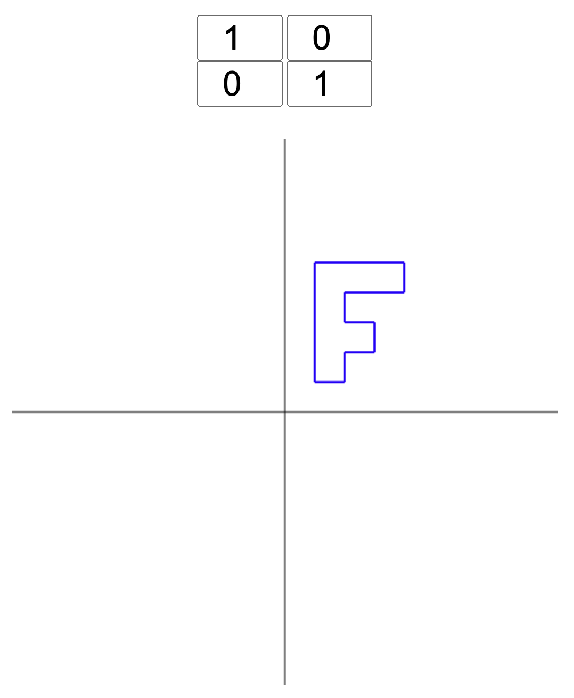

# Linear Transformation Plotter

This tool visualizes the impact of a 2x2 matrix multiplication on the shape of an object.
For simplicity, this object is represented by the letter "F."
You can enter any arbitrary numbers for the four matrix values, and the resulting shape will be visualized.

 [Interactive Page](https://lischilpp.github.io/linear-transformation-plotter)

# Screenshots
## Identity transformation

## Skew-Y transformation

## Mirror-X transformation

